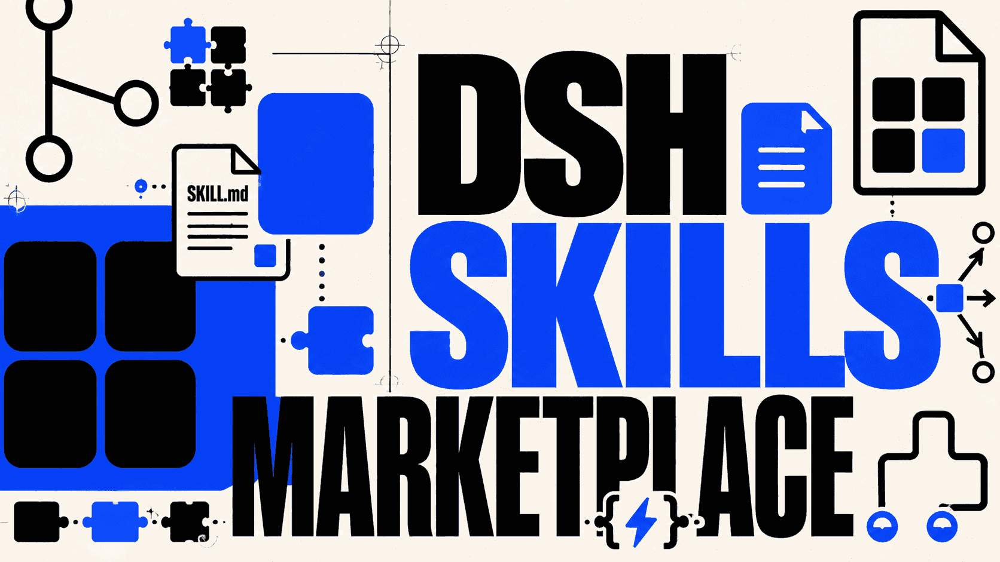
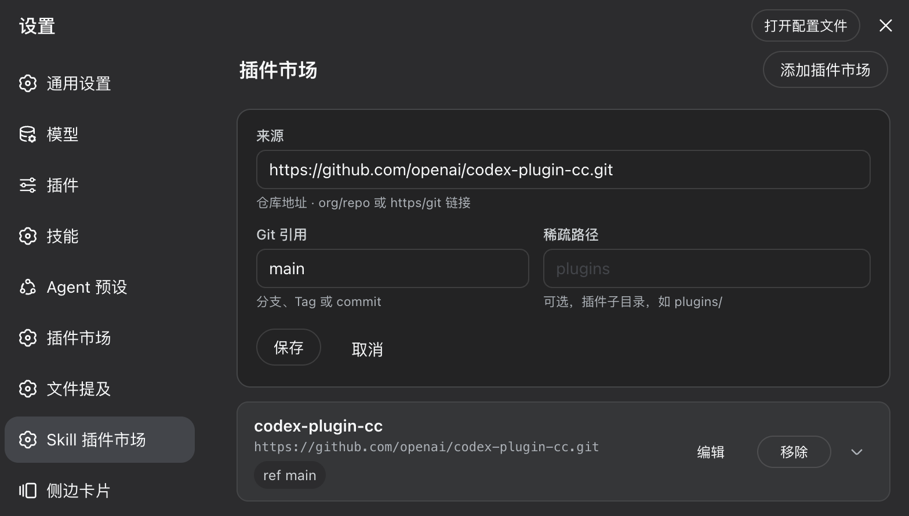
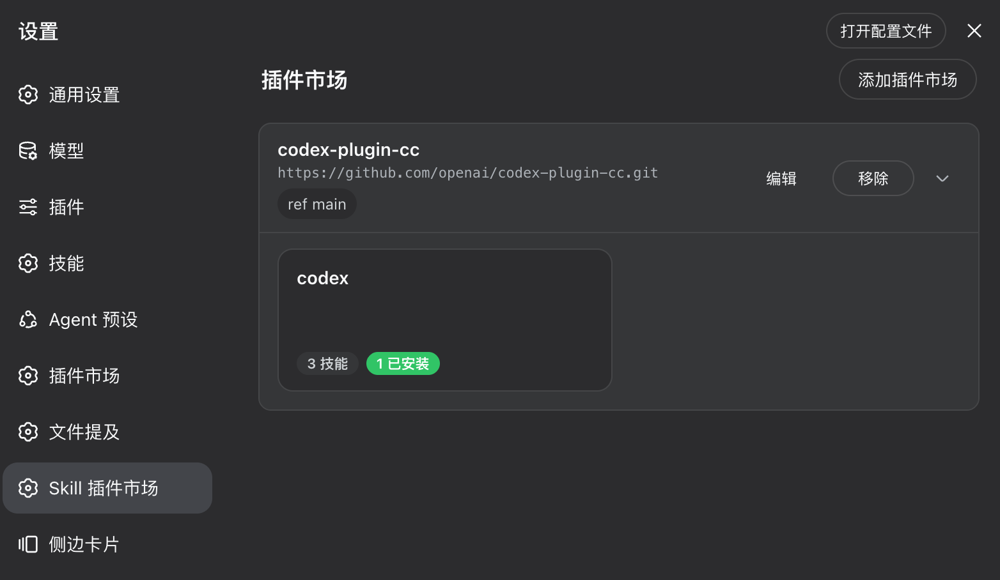
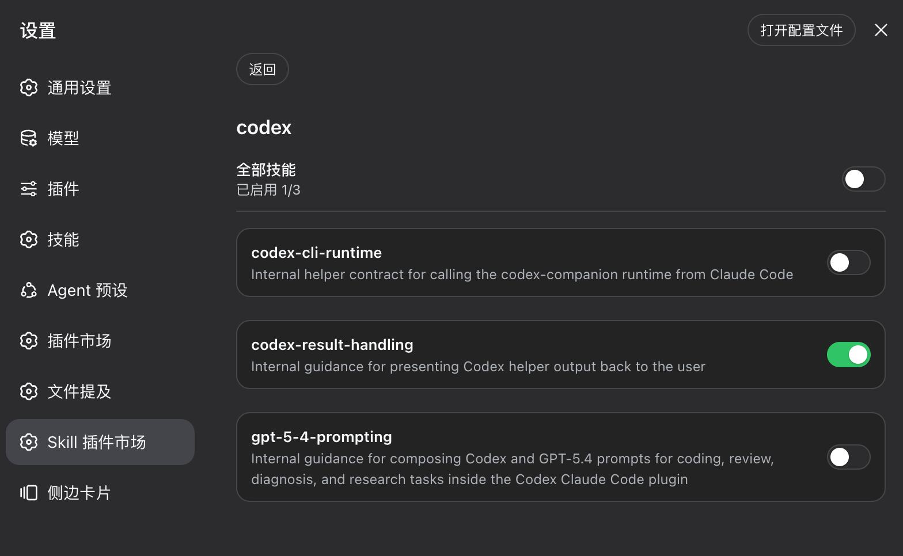

# DSH Skills Marketplace




**English** | [简体中文](./README.md)

> A DSH-native marketplace that organizes any Codex or Claude skill repository by plugin.

## Overview

Given a skill repository (`Git URL + branch + sparse path`), this tool sparse-checkouts the plugins and skills, **flattens** each skill into `~/.dsh/skills/<skill-name>/SKILL.md`, and presents the whole catalog **by plugin** (not by the flat skill list DSH natively shows).

The same `SKILL.md` files are the shared standard across DSL ecosystems — one skill library, reusable by **DSH, Codex and Claude** at the same time.

## Quick install

```bash
dsh plugin --profile web add github:cxdyun/dsh-skills-marketplace
```

Restart the selected DSH profile, then add a skill repository in **Settings → Skills Marketplace**. Replace `web` with another profile name when needed.

## Installation details

### Install as a DSH plugin (recommended)

Requirements: DSH, Node.js 22+, pnpm 10+, and permission to modify a DSH profile.

Install directly from GitHub:

```bash
dsh plugin --profile <profile> add github:cxdyun/dsh-skills-marketplace
```

### Install from npm

The published package does not require a GitHub build step and is recommended for normal use:

```bash
dsh plugin --profile <profile> add dsh-skills-marketplace
```

`dsh plugin` runs pnpm in the selected profile directory. The equivalent lower-level command is:

```bash
cd "$DSH_HOME/profiles/<profile>"
pnpm add dsh-skills-marketplace
```

Do not run this `pnpm add` command in the source checkout; that installs an ordinary project dependency and does not add the package to the DSH profile bundle list.

You can also pin a commit to prevent later remote changes:

```bash
dsh plugin --profile <profile> add github:cxdyun/dsh-skills-marketplace#<commit-sha>
```

Start the profile after installation:

```bash
dsh --profile <profile>
```

Then open `Settings → Skills Marketplace`.

<details>
<summary>Build from source (alternative)</summary>

```bash
git clone https://github.com/cxdyun/dsh-skills-marketplace.git
cd dsh-skills-marketplace
pnpm install
pnpm run check
```

</details>

If you build from source, add this project to your DSH profile and enable it using the same process as other Cordis plugins. Restart DSH, then open:

```text
Settings → Skills Marketplace
```

If the **Skills Marketplace** section appears, the plugin is loaded successfully. Add a skill source and install a plugin; its skills will be written to `~/.dsh/skills/` and become available to DSH agents.

> DSH determines the profile directory and enablement procedure. This project does not override the host's plugin setup; follow the same process used for other Cordis plugins.

## Quick start

### 1. Add a marketplace

Open **Settings → Skills Marketplace**, select “Add plugin marketplace”, then enter the repository URL and Git ref. Sparse path is optional; leave it empty when the repository root is the marketplace.



### 2. Expand the plugin list

Save the source, then use the expand control on the marketplace card to view its plugins and skill counts in place.



### 3. Manage skills

Open a plugin card to manage its skills with the overall or per-skill toggle.



### Verify the CLI without DSH

You can verify the core pipeline without installing DSH:

```bash
git clone https://github.com/cxdyun/dsh-skills-marketplace.git
cd dsh-skills-marketplace
pnpm install
node cli.mjs --help
node cli.mjs add "https://github.com/you/your-skills-repo.git" --ref main --path plugins
node cli.mjs catalog
```

The CLI does not require DSH; test installations are written to `~/.dsh/skills/`.

---

## Why this exists

DSH's `@deepseek-ai/dsh-skill-filesystem` natively scans these skill roots and reads `<name>/SKILL.md` front-matter:

| rank | scope | path |
|------|-------|------|
| 100 | project | `<project>/.dsh/skills` |
| 200 | project | `<project>/.agents/skills` |
| 400 | user | `~/.dsh/skills` ← **install target of this manager** |
| 500 | user | `~/.agents/skills` (shared with Codex/Claude) |

So **`SKILL.md` is the common format**. DSH does *not* parse the Codex/Claude *wrapping* layers (`marketplace.json`, `plugin.json`, `agents/openai.yaml`, MCP manifests). This manager bridges that gap by:

1. **Fetching** — `git sparse-checkout`, only the requested sparse path.
2. **Catalog resolution** — A) an explicit `dsh.market.json`, or B) convention-driven discovery over `plugins/*/skills/*/SKILL.md` (works with existing Codex/Claude repositories *zero-modification*).
3. **Flattening** — each skill is copied flat into `~/.dsh/skills/<skill-name>/` (one level deep; Codex-only `agents/openai.yaml` is stripped).
4. **Plugin-dimension management** — a local manifest (`plugin ↔ skills ↔ source ↔ commit`) drives the plugin-first GUI.

---

## Features

- **Repository → skills** — add any Git skill repository as a *source* (`url + ref + sparsePath`).
- **Plugin dimension** — skills grouped under their **plugin**, not a flat list.
- **Per-skill toggle** — enable/disable individual skills, installed into `~/.dsh/skills`.
- **Safe uninstall / prune** — only removes skills this manager installed (tracked via a tombstone set); never touches your own skills.
- **Refresh** — incremental fetch + orphan cleanup.
- **Dual front-ends** — a self-contained HTML GUI and a **dependency-free CLI** (core logic is pure Node, no DSH required to verify the pipeline).
- **Same-origin enforced** on all mutation endpoints.

---

## How it integrates with DSH

The built package is a **DSH (cordis) plugin** with two sides:

- **Host side** (`lib/index.js`)
  - declares `inject = ['settings', 'webServer']`;
  - registers the `skillMarket` settings namespace (`installRoot`, `autoInstall`) so it persists in the DSH settings page;
  - mounts the `/skills-marketplace/*` HTTP routes for the GUI and CLI.
- **Client side** (`lib/client.js`)
  - registers a **`settings.section`** named **“Skills Marketplace”** (`SkillMarketSection`) inside the DSH settings page;
  - provides the plugin list, plugin details and per-skill toggles.

**After install**, skills are written flat into `~/.dsh/skills/`, which the built-in `dsh-skill-filesystem` automatically watches — **no reload or extra loading config needed**; the skills are immediately available to DSH agents.

> To load this as a DSH plugin, install the built package the way you install any cordis plugin in your DSH profile, then open **Settings → Skills Marketplace**. The exact enablement flow is provided by the DSH host, not by this package.

The CLI below lets you verify the whole pipeline *without* DSH.

---

## Build

```bash
pnpm install
pnpm run check        # typecheck + build (produces lib/)
```

`pnpm run build` runs `node build.mjs`, which uses esbuild to emit:
- `lib/index.js` — host (cordis) bundle;
- `lib/client.js` — browser client (single-file `__ModuleLoader__` handshake);
- `lib/{manifest,remote,sync,http,routes}.js` — pure-ESM core reused by the CLI and tests;
- `.d.ts` type declarations via `tsc`.

---

## CLI usage (verify the core pipeline first)

```bash
# add a source (repo + branch + sparse path)
node cli.mjs add "https://github.com/you/your-skills-repo.git" --ref main --path plugins

node cli.mjs list                          # list added sources
node cli.mjs install my-plugin             # install a plugin (default: first source)
node cli.mjs view                          # plugin-dimension view (default: first source)
node cli.mjs uninstall my-plugin           # uninstall, removing only managed skills
node cli.mjs refresh my-source             # incremental update + orphan cleanup
node cli.mjs prune                         # clear tombstones
```

Commands: `add`, `list`, `catalog`, `install`, `install-all`, `uninstall`, `refresh`, `prune`, `view`.

---

## HTTP API (used by the GUI)

| Method | Path | Description |
|---|---|---|
| GET | `/skills-marketplace/sources` | list sources |
| POST | `/skills-marketplace/sources` | add `{url, ref?, sparsePath?}` |
| DELETE | `/skills-marketplace/sources/:id` | remove a source (keeps installed skills) |
| GET | `/skills-marketplace/catalog?source=<id>` | remote plugin/skill catalog (plugin-first) |
| GET | `/skills-marketplace/installed?source=<id>` | installed view |
| POST | `/skills-marketplace/install` | `{sourceId, pluginId, skills?}` |
| POST | `/skills-marketplace/uninstall` | `{sourceId, pluginId}` |
| POST | `/skills-marketplace/skill-toggle` | `{sourceId, pluginId, skill, on}` |
| POST | `/skills-marketplace/refresh/<sourceId>` | incremental update |

All non-GET endpoints enforce **same-origin** (verified to reject cross-origin with 403).

---

## GUI

Open `client/market.html` (or use the DSH **Settings → Skills Marketplace** section):

- **My markets** — source cards (shows `ref`/`sparse`) with an “Add plugin marketplace” form (source / branch / sparse path).
- **Plugin catalog** — rendered inside the **same card** as the source (mirrors DSH’s built-in inline-expanding plugin-list card): clicking a market card header expands/collapses the plugin grid in-place, no longer detached from its source; the card highlights with a border/shadow and the chevron rotates. Each plugin badge shows its skill and installed counts.
- **Plugin details** — per-skill toggles: on = installed into `~/.dsh/skills`, off = removed from the manifest and uninstalled.

---

## Security & safety

- **Safe uninstall** — only deletes managed skills tracked in the manifest; cleanup acts only on the *tombstone* set (previously installed, now invalid). Your own skills are never touched.
- **Cross-origin denied** — mutation endpoints enforce same-origin.
- **Codex-only files stripped** — `agents/openai.yaml` is never written to disk (DSH ignores it, and it would pollute the one-level layout).
- **MCP caveat** — skills that rely on external MCP only carry their `SKILL.md` instruction text on the DSH side (DSH does not launch `agents/openai.yaml` MCP servers); such skills are flagged in the UI.

---

## License

[MIT](./LICENSE)
